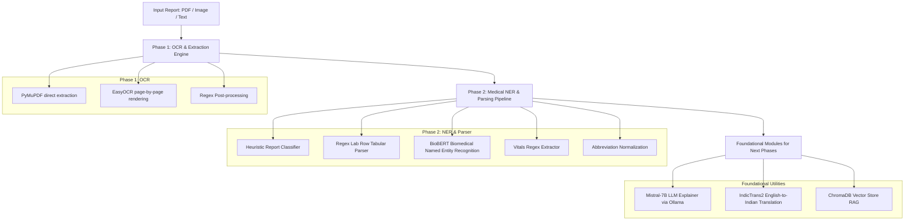

# ClearScript — AI Medical Report Translator

ClearScript is an AI-powered medical report translator designed to convert complex medical jargon, lab values, and doctor notes into plain, patient-friendly language. It is optimized for Indian healthcare contexts, supporting local medical terminology, standard abbreviation expansion, clinical categorization, and translation into Indian regional languages (Hindi, Tamil, Kannada).

---

## 🏗️ Project Architecture & Components

The application is structured as a modular Python backend consisting of the following core layers:



---

## 📈 Phase Breakdown: What Has Been Implemented

### **Phase 1: Document Ingestion & OCR Engine**
Handles reading files, extract text layers, or falls back to OCR.
* **Hybrid Extraction Logic**: Detects digital vs scanned documents. Uses **PyMuPDF (`fitz`)** to directly extract text from digital PDFs for maximum speed and accuracy. Falls back to **EasyOCR** for image-based scanned pages and graphic attachments.
* **Format Routing**: Supports all common formats: `.pdf`, `.png`, `.jpg`, `.jpeg`, `.webp`, `.bmp`, `.tiff`.
* **Report-Specific Post-processing**: Corrects common OCR recognition errors specific to Indian reports via regular expressions (e.g., correcting numerical issues like lowercase `l` to `1` or uppercase `O` to `0` next to numbers, and converting comma separators to decimal points).
* **Endpoints & Validation**: Exposes a `POST /ocr/extract` API endpoint and includes a verification CLI script.

### **Phase 2: Medical NER & Extraction Pipeline**
Converts unstructured/semi-structured OCR output into structured JSON findings.
* **Report Type Classifier**: Heuristically determines if a report is **structured** (a tabular lab report), **narrative** (discharge summary/doctor's notes), or **mixed** (containing both blocks of text and tables) based on text patterns and medical keywords.
* **Tabular Rule-Based Parser**: Operates with five distinct regex patterns tailored for typical Indian pathology formats, extracting test names, numeric values, units, reference ranges, and abnormal flags (`HIGH`/`LOW`).
* **Narrative Deep-Learning Parser**: Implements the `d4data/biomedical-ner-all` fine-tuned **BioBERT** model via HuggingFace's token classification pipeline. Includes text-chunking to prevent memory issues.
* **Vitals Regular Expressions**: Parses health metrics like Blood Pressure (`BP`), Pulse (`heart rate`), Temperature, Oxygen Saturation (`SpO2`), and Respiratory Rate (`RR`).
* **Abbreviation & LOINC Normalizer**: Normalizes shorthand lab entities (e.g., TLC, DLC, PLT, Hb) to their canonical forms, full descriptions, clinical classifications, and appropriate LOINC identifiers.
* **Pipeline Merger**: Deduplicates findings from rule-based and deep learning parsers, prioritizing rule-based findings to preserve numerical accuracy.
* **Endpoints**: Exposes a `POST /ner/extract` endpoint that accepts raw text or handles file uploads directly.

### **Foundational Utilities (Next Phases)**
The foundation for upcoming steps has been built and verified:
* **AI Explainer (Mistral-7B)**: Generates patient-friendly explanations for extracted medical values. Connects locally via Ollama with robust default fallback explanations in case the local LLM is offline.
* **Indic Translation (IndicTrans2)**: Built-in support to translate plain-English explanations into **Hindi**, **Tamil**, and **Kannada** using AI4Bharat's `indictrans2-en-indic-1B` model.
* **ChromaDB Vector Store**: Configured to chunk, embed (using `sentence-transformers/all-MiniLM-L6-v2`), and persist medical summaries to provide local context-aware Retrieval-Augmented Generation (RAG) search capabilities.

---

## 🛠️ Getting Started & Setup

### **1. Environment Setup**
Ensure you have **Python 3.10+** installed, then run:

```bash
# Clone the repository
git clone https://github.com/Suryakl64/ClearScript.git
cd ClearScript

# Create virtual environment and activate
python -m venv venv
venv\Scripts\activate   # On Windows
source venv/bin/activate # On Unix/macOS

# Install dependencies
pip install -r requirements.txt
```

### **2. Verification Check**
Verify that all packages and deep learning packages are installed and configured:
```bash
python check_setup.py
```

### **3. Running Tests**
Run the automated testing scripts for OCR and NER pipelines:
```bash
# Test OCR extraction
python backend/ocr/test_ocr.py

# Test the consolidated NER pipeline
python backend/ner/test_ner_pipeline.py
```

### **4. Launching the API Server**
Start the FastAPI backend server using Uvicorn:
```bash
uvicorn backend.api.main:app --reload
```
* Once running, visit the interactive swagger documentation at: `http://127.0.0.1:8000/docs`

---

## 📁 Repository Structure
```
ClearScript/
├── backend/
│   ├── api/             # FastAPI routes for OCR & NER extraction
│   ├── data/            # Local JSON databases (LOINC reference ranges, abbreviations)
│   ├── llm/             # Ollama integration & AI Explainer logic
│   ├── models/          # Model structures
│   ├── ner/             # Heuristic classifier, BioBERT parser, rule parser, normalizer
│   ├── ocr/             # Hybrid extractor (PyMuPDF & EasyOCR) and clean-up
│   ├── parser/          # Helper parsers
│   ├── rag/             # Vector Database (ChromaDB) indexing
│   ├── translation/     # IndicTrans2 translator
│   ├── utils/           # Shared utility tools
│   ├── config.py        # Global model & path configurations
│   └── constants.py     # Medical disclaimer and shared constants
├── reports_test/        # Folder to place mock PDF/images for verification
├── check_setup.py       # Package validation utility
├── requirements.txt     # Python dependencies
└── README.md            # You are here!
```

---

> [!IMPORTANT]
> **Medical Disclaimer**: ClearScript provides AI-generated summaries for informational and educational purposes only. This is NOT medical advice, diagnosis, or treatment. Always consult a qualified healthcare professional before making any health decisions.
