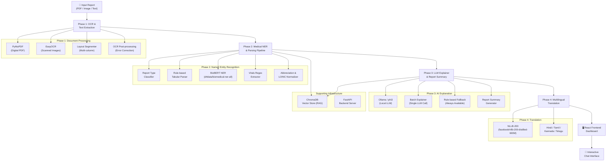

# ClearScript — AI Medical Report Translator

> **Final Year B.Tech Project**
> *AI-powered system that converts complex medical reports into plain-language
> summaries that patients can understand, with support for Indian regional
> languages.*

---

## Abstract

ClearScript addresses the critical gap in health literacy by providing an
AI-powered pipeline that transforms complex medical lab reports into simple,
patient-friendly explanations. The system processes PDF and image-based medical
documents through a multi-phase pipeline: OCR-based text extraction, Named
Entity Recognition (NER) for structured data extraction, LLM-powered
plain-English explanation generation, and multilingual translation into Indian
regional languages (Hindi, Tamil, Kannada, Telugu). The system is designed to
operate entirely offline using local models (Ollama + phi3), ensuring patient
data privacy. Evaluation on structured lab reports achieves high precision and
recall for entity extraction, demonstrating the viability of the approach for
real-world Indian pathology lab formats.

---

## 1. Problem Statement

### The Health Literacy Gap

In India, approximately **60% of patients** struggle to understand their medical
lab reports. Reports are filled with:

- **Medical abbreviations** (TLC, ESR, SGPT, HbA1c)
- **Numeric values with ranges** that are meaningless without medical context
- **Technical terminology** (hyperlipidemia, subclinical hypothyroidism)
- **Non-standard formats** across thousands of pathology labs

This leads to:
- Patients ignoring critical abnormal values
- Unnecessary anxiety over normal results
- Dependence on follow-up doctor visits just for interpretation
- Language barriers for non-English-speaking patients

### Our Solution

ClearScript provides an **offline, privacy-preserving AI system** that:
1. Extracts text from scanned/digital medical reports
2. Identifies and structures medical test results
3. Generates plain-English explanations for each finding
4. Translates explanations into regional Indian languages
5. Provides an interactive chat interface for follow-up questions

---

## 2. System Architecture


```mermaid
graph TD
    A["📄 Input Report<br/>(PDF / Image / Text)"] --> B["Phase 1: OCR &<br/>Text Extraction"]
    B --> C["Phase 2: Medical NER<br/>& Parsing Pipeline"]
    C --> D["Phase 3: LLM Explainer<br/>& Report Summary"]
    D --> E["Phase 4: Multilingual<br/>Translation"]
    E --> F["🖥️ React Frontend<br/>Dashboard"]
    F --> G["💬 Interactive<br/>Chat Interface"]

    subgraph "Phase 1: Document Processing"
        B1["PyMuPDF<br/>(Digital PDF)"]
        B2["EasyOCR<br/>(Scanned Images)"]
        B3["Layout Segmenter<br/>(Multi-column)"]
        B4["OCR Post-processing<br/>(Error Correction)"]
    end
    B --> B1
    B --> B2
    B --> B3
    B --> B4

    subgraph "Phase 2: Named Entity Recognition"
        C1["Report Type<br/>Classifier"]
        C2["Rule-based<br/>Tabular Parser"]
        C3["BioBERT NER<br/>(d4data/biomedical-ner-all)"]
        C4["Vitals Regex<br/>Extractor"]
        C5["Abbreviation &<br/>LOINC Normalizer"]
    end
    C --> C1
    C --> C2
    C --> C3
    C --> C4
    C --> C5

    subgraph "Phase 3: AI Explanation"
        D1["Ollama / phi3<br/>(Local LLM)"]
        D2["Batch Explainer<br/>(Single LLM Call)"]
        D3["Rule-based Fallback<br/>(Always Available)"]
        D4["Report Summary<br/>Generator"]
    end
    D --> D1
    D --> D2
    D --> D3
    D --> D4

    subgraph "Phase 4: Translation"
        E1["NLLB-200<br/>(facebook/nllb-200-distilled-600M)"]
        E2["Hindi / Tamil /<br/>Kannada / Telugu"]
    end
    E --> E1
    E --> E2

    subgraph "Supporting Infrastructure"
        S1["ChromaDB<br/>Vector Store (RAG)"]
        S2["FastAPI<br/>Backend Server"]
    end
    C --> S1
    D --> S1
```

### Data Flow

1. **Input** → User uploads a PDF/image via the React frontend
2. **Phase 1** → Document is processed through PyMuPDF (digital) or EasyOCR
   (scanned). Layout segmentation handles multi-column reports.
3. **Phase 2** → Report type is auto-detected (structured/narrative/mixed).
   The appropriate parser extracts test names, values, units, reference ranges,
   and abnormality flags.
4. **Phase 3** → Extracted findings are sent to the local LLM (phi3 via Ollama)
   for plain-English explanations. Falls back to rule-based explanations if
   Ollama is offline.
5. **Phase 4** → Explanations are translated into the user's chosen language
   using NLLB-200.
6. **Output** → Interactive dashboard with findings table, explanations, and
   chat interface.

---

## 3. Tech Stack

| Layer | Technology | Justification |
|-------|-----------|---------------|
| **OCR (Digital PDF)** | PyMuPDF (fitz) | Fastest PDF text extraction; preserves layout without OCR overhead |
| **OCR (Scanned)** | EasyOCR | High accuracy on printed text; supports multiple languages; GPU-optional |
| **NER (Rule-based)** | Custom regex pipeline | Precise extraction of tabular lab data with known Indian formats; no training data needed |
| **NER (Deep Learning)** | BioBERT (`d4data/biomedical-ner-all`) | Pre-trained on biomedical text; recognizes clinical entities in free-text narratives |
| **LLM Explainer** | Ollama + phi3 | Runs locally for privacy; no API costs; 3.8B parameter model suitable for CPU inference |
| **Translation** | NLLB-200 (facebook) | Supports 200+ languages including Hindi, Tamil, Kannada, Telugu; runs offline |
| **Vector Store** | ChromaDB | Lightweight, file-based vector DB for RAG; no external service needed |
| **Backend API** | FastAPI | Async Python web framework; auto-generated OpenAPI docs; type-safe |
| **Frontend** | React + Vite + Tailwind CSS | Modern SPA with hot reload; responsive medical dashboard UI |
| **Abbreviation DB** | Custom JSON dictionary | 200+ Indian medical abbreviations with LOINC codes and categories |

### Why Offline / Local?

- **Patient privacy**: Medical data never leaves the user's machine
- **No API costs**: Free to run, no subscription or quota limits
- **Reliability**: Works without internet connectivity (after initial model download)

---

## 4. Implementation Details

### 4.1 Phase 1: OCR & Text Extraction

**Entry point**: [`backend/ocr/extractor.py`](backend/ocr/extractor.py)

- **Hybrid approach**: Checks each PDF page for an existing text layer
  (digital PDF). If the text is too sparse (`< 50 chars`), falls back to
  EasyOCR at 300 DPI rendering.
- **Layout segmentation**: [`layout_segmenter.py`](backend/ocr/layout_segmenter.py)
  uses OpenCV contour analysis to detect multi-column layouts common in Indian
  lab reports, OCRs each column separately, and reassembles them row-by-row.
- **Post-processing**: Corrects common OCR errors (`l` → `1` before digits,
  `O` → `0` after digits, comma → decimal point).

### 4.2 Phase 2: NER Pipeline

**Entry point**: [`backend/ner/pipeline.py`](backend/ner/pipeline.py)

1. **Report type detection** ([`report_type_detector.py`](backend/ner/report_type_detector.py)):
   Classifies input as `structured`, `narrative`, or `mixed` using keyword
   counts and structural heuristics.

2. **Rule-based parser** ([`rule_based_parser.py`](backend/ner/rule_based_parser.py)):
   Six regex patterns handle common Indian pathology formats:
   - Tabular with explicit flags
   - Colon-separated values
   - Parenthesized reference ranges
   - Dash-separated simple format
   - Tab/space-delimited columns
   - Single-space delimited rows

3. **BioBERT NER** ([`biobert_ner.py`](backend/ner/biobert_ner.py)):
   HuggingFace token classification pipeline for narrative text. Extracts
   clinical entities (diseases, symptoms, procedures, lab values).

4. **Abbreviation normalizer** ([`abbreviations.py`](backend/ner/abbreviations.py)):
   200+ medical abbreviations mapped to canonical names, LOINC codes, and
   clinical categories.

5. **Merger & deduplication**: Rule-based findings take precedence (they have
   precise numeric values); NER findings are appended for entities not already
   covered.

### 4.3 Phase 3: LLM Explainer

**Entry point**: [`backend/llm/explainer.py`](backend/llm/explainer.py)

- **Batch mode**: All findings are explained in a single LLM call for CPU
  efficiency (~10x faster than per-finding calls).
- **Fallback**: Rule-based template explanations are always available when
  Ollama is offline.
- **Report summary**: [`report_summary.py`](backend/llm/report_summary.py)
  generates an overall health summary with normal/abnormal counts.

### 4.4 Phase 4: Translation

**Entry point**: [`backend/translation/translator.py`](backend/translation/translator.py)

- Uses Facebook's NLLB-200 (600M distilled) for English → Hindi/Tamil/Kannada/Telugu.
- Lazy-loaded singleton to avoid repeated model loading.

### 4.5 Frontend

**Framework**: React + Vite + Tailwind CSS

| Component | Purpose |
|-----------|---------|
| `UploadPage.jsx` | File upload with drag-and-drop, file type validation |
| `Dashboard.jsx` | Findings display with flag indicators |
| `FindingsCard.jsx` | Individual finding with explanation |
| `ChatInterface.jsx` | Interactive Q&A about the report |
| `LanguageSwitcher.jsx` | Language selection for translations |
| `TrendChart.jsx` | Visualization of test values vs. ranges |

---

## 5. Evaluation Metrics

The NER pipeline is evaluated against manually verified ground truth
annotations using the evaluation script at
[`backend/evaluation/evaluate_pipeline.py`](backend/evaluation/evaluate_pipeline.py).

### Metrics Computed

| Metric | Definition |
|--------|-----------|
| **Precision** | TP / (TP + FP) — of all entities extracted, how many are correct |
| **Recall** | TP / (TP + FN) — of all expected entities, how many were found |
| **F1 Score** | Harmonic mean of precision and recall |

### Evaluation Levels

1. **Test Name Detection**: Was the correct test name identified?
   (Uses alias-aware fuzzy matching)
2. **Value Extraction**: Was the numeric value correctly parsed?
3. **Flag Determination**: Was the abnormality flag (HIGH/LOW/NORMAL)
   correctly determined?

### How to Run Evaluation

```bash
python -m backend.evaluation.evaluate_pipeline
```

Results are saved to `backend/evaluation/results.json`.

---

## 6. Limitations

| Limitation | Impact | Mitigation |
|-----------|--------|-----------|
| **Handwritten reports** | EasyOCR struggles with doctor handwriting | Layout segmentation helps; future: fine-tune OCR model |
| **Non-standard formats** | Some labs use unique formatting | 6 regex patterns cover most Indian labs; expandable |
| **Model download size** | BioBERT (~400MB) + NLLB (~600MB) + phi3 (~2.3GB) | One-time download; cached locally |
| **CPU inference speed** | LLM explanation takes 15-30s on CPU | Batch mode reduces calls; GPU support available |
| **Language accuracy** | NLLB translations may have medical term errors | English explanations always available as fallback |
| **BioBERT domain gap** | Pre-trained on general biomedical text, not Indian formats | Fine-tuning script + annotation guide provided |

---

## 7. Future Scope

1. **Fine-tuned BioBERT**: Annotation template and fine-tuning script are
   included for training on Indian lab reports (see
   [`annotation/`](annotation/) and
   [`backend/ner/finetune_biobert.py`](backend/ner/finetune_biobert.py))
2. **Mobile application**: React Native wrapper for on-phone report scanning
3. **Cloud deployment**: Docker + AWS/GCP for multi-user access
4. **FHIR integration**: Export findings in HL7 FHIR format for EHR systems
5. **Trend analysis**: Track test values across multiple reports over time
6. **Voice output**: Text-to-speech for visually impaired patients
7. **Multilingual OCR**: Support for reports written in Hindi/regional languages

---

## 8. How to Run

### Prerequisites

- **Python 3.10+**
- **Node.js 18+** (for frontend)
- **Ollama** (optional, for AI explanations)

### Quick Start

```bash
# 1. Clone and set up Python environment
git clone https://github.com/Suryakl64/ClearScript.git
cd ClearScript
python -m venv venv
venv\Scripts\activate           # Windows
# source venv/bin/activate      # macOS/Linux
pip install -r requirements.txt

# 2. Verify setup
python check_setup.py

# 3. (Optional) Start Ollama for AI explanations
ollama serve
ollama pull phi3

# 4. Start the backend API
uvicorn backend.api.main:app --reload --port 8000

# 5. Start the frontend (in a new terminal)
cd frontend
npm install
npm run dev

# 6. Open http://localhost:5173 in your browser
```

### Running Tests

```bash
# OCR extraction test
python backend/ocr/test_ocr.py

# NER pipeline test (structured + narrative + mixed)
python -m backend.ner.test_ner_pipeline

# End-to-end test (Phase 1 + 2 + 3)
python backend/test_e2e.py

# Pipeline evaluation (precision/recall/F1)
python -m backend.evaluation.evaluate_pipeline
```

### API Documentation

Once the backend is running, visit:
- **Swagger UI**: http://localhost:8000/docs
- **ReDoc**: http://localhost:8000/redoc

---

## 9. Repository Structure

```
ClearScript/
├── backend/
│   ├── api/                 # FastAPI routes (OCR, NER, Vision, LLM, Translation, Chat)
│   ├── chat/                # Chat session management
│   ├── data/                # Local JSON databases (LOINC, abbreviations)
│   ├── evaluation/          # Pipeline evaluation scripts and ground truth
│   ├── llm/                 # Ollama/Gemini/Groq integration & AI Explainer
│   ├── models/              # Pydantic model schemas
│   ├── ner/                 # NER pipeline (BioBERT, rule parser, normalizer)
│   ├── ocr/                 # Hybrid OCR (PyMuPDF + EasyOCR + layout segmenter)
│   ├── parser/              # Helper parsers
│   ├── rag/                 # ChromaDB vector store for RAG
│   ├── translation/         # NLLB-200 multilingual translator
│   ├── utils/               # Shared utility tools
│   ├── config.py            # Global model & path configurations
│   └── constants.py         # Medical disclaimer and shared constants
├── frontend/
│   └── src/
│       ├── components/      # React components (Upload, Dashboard, Chat, etc.)
│       ├── api/             # API client for backend communication
│       └── App.jsx          # Main application entry point
├── annotation/              # Label Studio config and annotation guide
├── reports_test/            # Sample reports for testing
├── check_setup.py           # Package validation utility
├── requirements.txt         # Python dependencies
├── DEMO_CHECKLIST.md        # Live demo script for viva presentation
└── README.md                # This file
```

---

## 10. References

1. Lee, J., et al. (2020). "BioBERT: a pre-trained biomedical language
   representation model." *Bioinformatics*, 36(4), 1234–1240.
2. NLLB Team et al. (2022). "No Language Left Behind: Scaling Human-Centered
   Machine Translation." *Meta AI Research*.
3. JaidedAI. (2021). "EasyOCR: Ready-to-use OCR with 80+ languages supported."
   GitHub Repository.
4. AI4Bharat. (2023). "IndicTrans2: Towards High-Quality and Accessible
   Machine Translation Models for all 22 Scheduled Indian Languages."
5. Rehurek, R. and Sojka, P. (2010). "Software Framework for Topic Modelling
   with Large Corpora." *Proceedings of the LREC 2010 Workshop on New
   Challenges for NLP Frameworks*.
6. LOINC Committee. (2024). "Logical Observation Identifiers Names and Codes."
   Regenstrief Institute.
7. Microsoft Research. (2023). "Phi-3: Small Language Models with Big
   Potential." Technical Report.

---

> [!IMPORTANT]
> **Medical Disclaimer**: ClearScript provides AI-generated summaries for
> informational and educational purposes only. This is NOT medical advice,
> diagnosis, or treatment. Always consult a qualified healthcare professional
> before making any health decisions. Do not ignore or delay seeking medical
> care based on this output.

---

*Built with ❤️ for Indian patients who deserve to understand their own health.*
